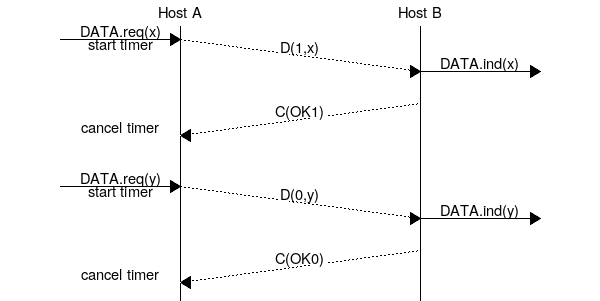
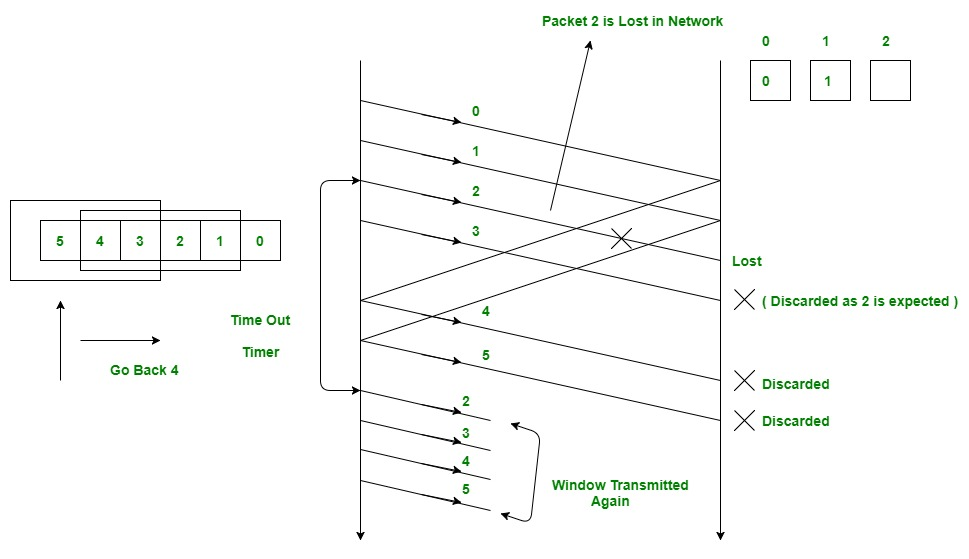
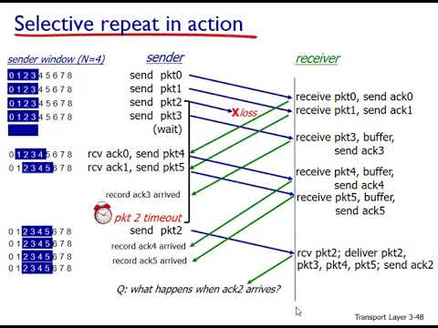

# Reliable Data Transport Protocols - Project Documentation

## Overview

This project focuses on the implementation of three reliable data transport protocols: Alternating-Bit (ABT), Go-Back-N (GBN), and Selective-Repeat (SR). The goal is to provide a robust and efficient communication framework based on the specifications outlined in the textbook. The implementations cover a range of pages (ABT: 208-211, GBN: 215-220, SR: 220-226) and adhere to the PA2 template for consistency and compatibility.

## Installation

To set up the project, follow the detailed instructions provided in the **PA2 Template Installation Instructions** document. Ensure that you use this template as it is mandatory for the project.

## Programming Environment

The project is coded in C (or C++) and is meant to compile under the GCC (GNU Compiler Collection) environment. The code should be compiled and tested on the ONE host assigned by the course instructor. Do not use any machine other than the designated host.

### Compilation Process

Compile the code using the `gcc` (for C code) or `g++` (for C++ code) version found on the assigned host. The compilation process should not involve any disk I/O unless explicitly stated in the project description.

## Project Structure

The project consists of implementations for the following reliable data transport protocols:

1. **Alternating-Bit Protocol (rdt3.0)**
   - Detailed implementation from pages 208 to 211.
   - 

2. **Go-Back-N Protocol**
   - In-depth implementation covering pages 215 to 220.
   - 

3. **Selective-Repeat Protocol**
   - Comprehensive implementation detailed on pages 220 to 226.
   - 

## How to Use

1. **Compile the Code:**
   - Utilize the provided `gcc` (or `g++`) compiler on the assigned host. Refer to the compilation guidelines in the PA2 template.

2. **Execution:**
   - Execute the compiled code on the ONE host, following the specific instructions for each protocol.

## Documentation

For a comprehensive understanding of each protocol's implementation, refer to the code files dedicated to each protocol. Additionally, explore the comments within the code for valuable insights into the underlying logic and functionalities.

## Results and Analysis

Please see Below Images for Loss Probability from L = 0.2 to 0.8

1. 
2. 
3. 

   for more analysis go to [PA2.pdf](/PA2.pdf)